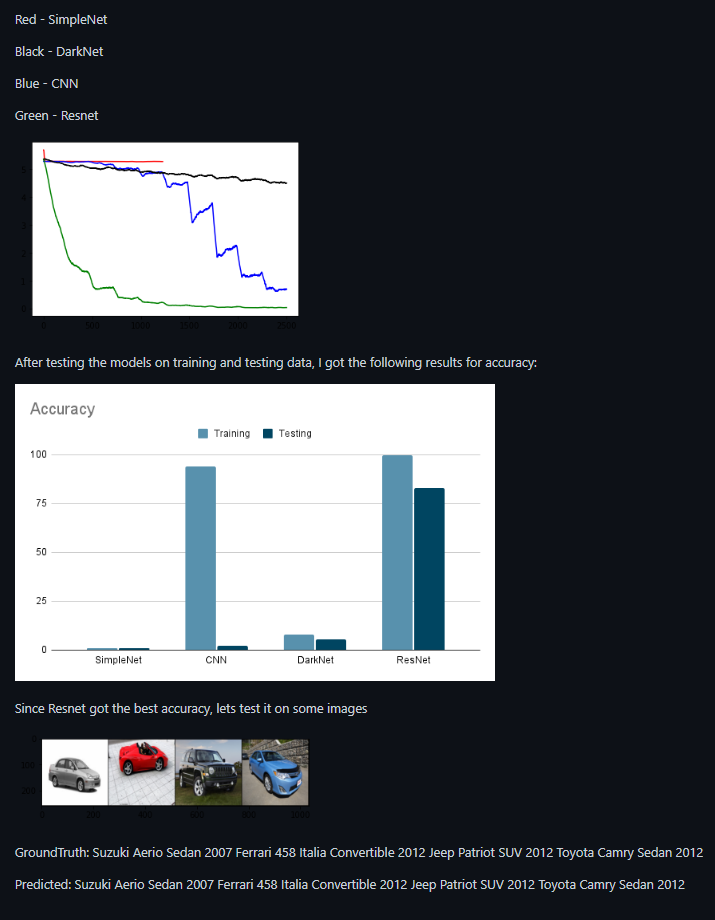

<h3>Car Classification</h3> ([Github](https://github.com/ammarj0987/Computer-Vision))

In this project, I used pytorch, numpy and scipy. I downloaded Stanford's Car Dataset into classes such as test, train and labels. Then i implmented some training models and training function. With the help of Matplotlib, I compared the loss results of each training model and then used the most accurate model for testing. The goal of this project was to find the most accurate training model and I was able to achive 88% testing accuracy with ResNet.

