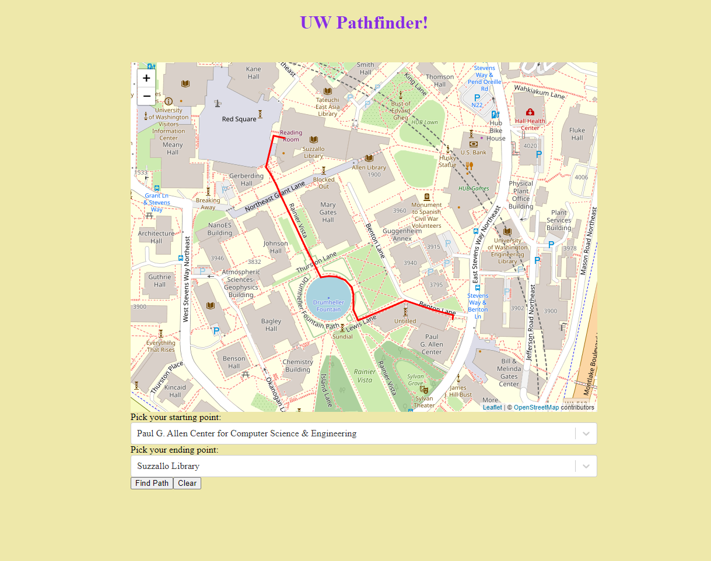

<h3>UW Pathfinder</h3> ([email](ammar.junejo0987@yahoo.com) for access)

In this project, I used Spark framework for backend and React for frontend. The goal of the project was to find the shortest path between two buildings on UW campus. I implemented a graph from scratch that has edges as routes and nodes as buildings. By implementing and applying Dijkstra's algorithm, I was able to find the shortest paths in the graph. In the app, user can choose buldings from a drop-down menu and when draw is clicked, a route is drawn on the map showing the shortest route between the two selected buildings.

